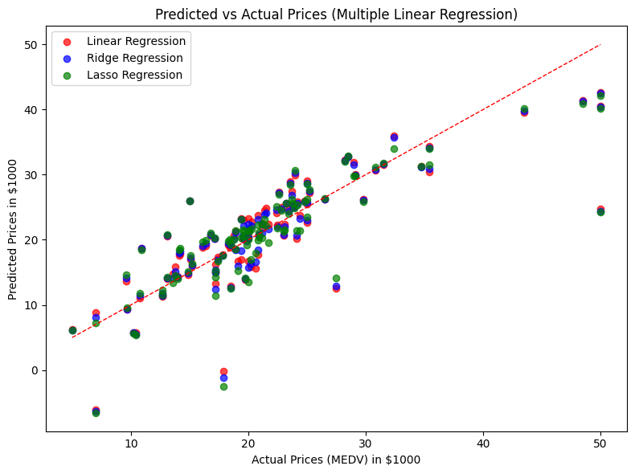

# 🏠 Regression Models on Boston Housing Dataset

This project applies **Linear Regression, Ridge Regression, and Lasso Regression** on the **Boston Housing Dataset** to predict housing prices.  
The dataset contains various socio-economic and environmental factors that influence the median value of owner-occupied homes (`MEDV`).

---

## 📊 Dataset Features
- **CRIM**: per capita crime rate by town  
- **ZN**: proportion of residential land zoned for lots over 25,000 sq.ft.  
- **INDUS**: proportion of non-retail business acres per town  
- **CHAS**: Charles River dummy variable (= 1 if tract bounds river; 0 otherwise)  
- **NOX**: nitric oxides concentration (parts per 10 million)  
- **RM**: average number of rooms per dwelling  
- **AGE**: proportion of owner-occupied units built prior to 1940  
- **DIS**: weighted distances to five Boston employment centres  
- **RAD**: index of accessibility to radial highways  
- **TAX**: full-value property-tax rate per $10,000  
- **PTRATIO**: pupil-teacher ratio by town  
- **B**: 1000(Bk - 0.63)² where Bk is the proportion of Black residents by town  
- **LSTAT**: % lower status of the population  
- **MEDV (Target)**: Median value of owner-occupied homes in $1000's  

---

## ⚙️ Steps Implemented
### 1. Load the Dataset
- Data imported from [https://raw.githubusercontent.com/jbrownlee/Datasets/master/housing.data].  
- Added feature names.  
- Checked descriptive statistics and missing values.  

### 2. Data Preprocessing
- Split dataset into **80% training** and **20% testing** using `train_test_split`.  

### 3. Train Models
- **Linear Regression**  
- **Ridge Regression** (α=1.0)  
- **Lasso Regression** (α=0.1)  

### 4. Evaluate Models
Metrics calculated:
- **MSE** (Mean Squared Error)  
- **RMSE** (Root Mean Squared Error)  
- **R² Score**  
- **MAE** (Mean Absolute Error)  

### 5. Compare Results
All metrics are displayed in a pandas DataFrame for comparison.  

### 6. Visualization
- Scatter plots of **Predicted vs Actual** housing prices for all models.  
- A prediction line is plotted for easy comparison.  

---

## 📈 Output

### Predicted vs Actual Prices


---

## 🚀 How to Run
1. Clone the repository:
   ```bash
   git clone https://github.com/imran-sony/regression-housing.git
